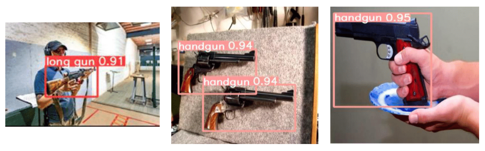

# :gun: Influence of Perceptual Variabilities on Firearm Detection using Deep Learning (YOLOv5 Firearms Detection)
In this repository you can find the code needed to train, apply and test the YOLOv5 model for the detection of handguns and long guns as well as the data used, trained models and results obtained.

## :page_facing_up: Project Report
The project report is **Memoria.pdf** (Spanish).

## :notebook: Google Colab Notebook 
The Google Colab notebook named **WeaponDetectionYOLOv5** contains the code used for training, validation of the YOLOv5s model for weapon detection. The instructions to follow to execute it correctly are included as text cells in the notebook itself. It is enough to execute them in the order in which they appear. 
## :alembic: Experiments

To access the experiments: https://drive.google.com/drive/folders/15O3lpCT-JYyuhEc5WftPzr0vCELjLPSS?usp=drive_link  
In the link you will find a folder for each experiment containing the datasets used and the results obtained.

### Datasets
The **DATASETS** folder contains the different datasets used in the experiment described in the memory. 
They include the images subdivided in folders train, valid and test, or only test in case the dataset has been used to test the performance of the trained model under certain conditions. They also contain a Yaml extension file where the path to the images in dataset folders is indicated. 

Warning: In some cases it will be necessary to modify the path in the Yaml file so that it detects the images correctly in Google Colab adapting it to the Drive directory where they are contained. The Google Colab workbook explains in more detail how to modify it.

### Results 
In the **RESULTADOS** folder you will find the results obtained when detecting the weapons for each experiment as well as the results of the evaluation metrics.

### Models
The models already trained based on YOLOv5s and YOLOv5m are included in the **Modelos** folder. YOLOv5s is the one used in the experiments.
If you do not want to train again, you can use the models contained here.
